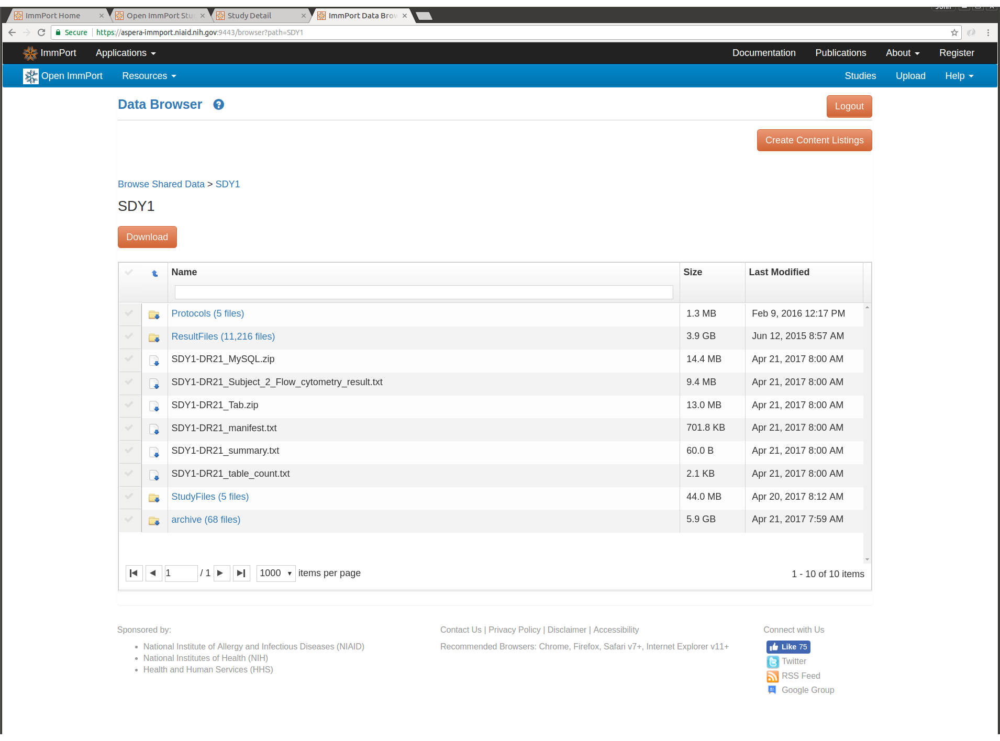

*************************
Data Availability
*************************

Registration for ImmPort is free, but you must register to download the
study data. For this project the ALLSTUDIES-DR21_MySQL.zip package was
used. This package contains scripts for creating and loading a MySQL
database that contains all the metadata information for all public
studies. There are similar packages for each individual study, and in
Tab-separated format as an additional option. Experimental result data
can also be downloaded, examples of the types of data available are: Flow
Cytometry FCS files, Elisa results, Elispot results, etc.

Screen Shot for SDY1
--------------------

